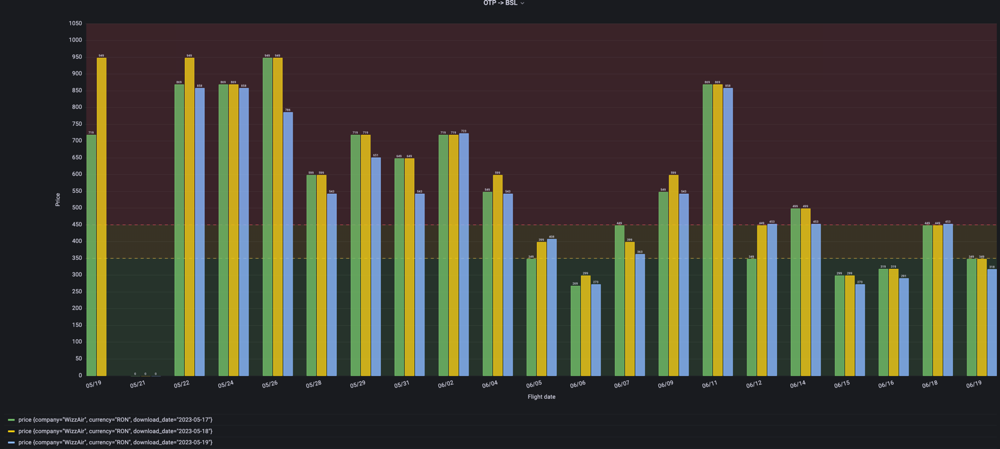

# Come fly with me

`Come fly with me` is a data scraping project that enables users to gather up-to-date information on flights directly 
from flight companies using API requests as performed in web browsers.

I developed this project to see how prices evolve over time for different flights routes. Whether you're a travel 
enthusiast, an aviation professional, or a data analyst, this project provides a versatile solution for extracting 
valuable flight data.

Thank you, [@gencraft](https://gencraft.com/), for the logo.

## Deploy

The `deploy` directory contains all the deployment strategies supported. Inside every directory there will be a 
`README.md` explaining how to deploy and use the tool.

## Data visualisation

Data can be visualised using `Grafana`. Depending on the deployment strategy, the server will be at a different location.

An example of a dashboard showing how the data looks like can be seen bellow, where the `WizzAir`'s prices were scraped
in three consecutive days:

## Settings

This section presents the configuration files that need to be configured by the user.

| File path (relative to project's root)  |                                                               Role                                                               | Requires redeployment |
|-----------------------------------------|:--------------------------------------------------------------------------------------------------------------------------------:|----------------------:|
| ./scrapers/scrapers/airline_routes.json | contains a `JSON` configuration of which routes a spider will scrape.  This file can be changed in `settings.py` from bellow |                   Yes |
| ./scrapers/scrapers/settings.py         |                                  This is where `scrapy` framework holds spider related settings                                  |                   Yes |

## Known Issues

* `WizzAir` changes the API version quiet often. I couldn't find an automated solution except manually changing request
URL to the new API.
* From time to time I get `400` response on some requests when scraping`WizzAir`. I found mimicking a human request 
(setting headers and cookies) to help, but not fixing the problem 100%. Perhaps I still miss some cookies or headers.
* I get too much data when scraping `EasyJet`. This is because the normal flow in the UI, when searching for tickets, 
requires the user to press a button and then the user will see the tickets. So I came up with another request that 
returns more data than required.
* At the moment I am scraping the currency too. This is because `WizzAir` won't allow me to set the currency code in the
request, unlike `RyanAir` and `EasyJet`, and will return me the price using the departure airport's currency.

## Future plans

* Add more spiders to collect data from more companies, if required.
* Make sure deployment strategies are more customizable (e.g: at the moment the `Kafka` settings are hardcoded).
